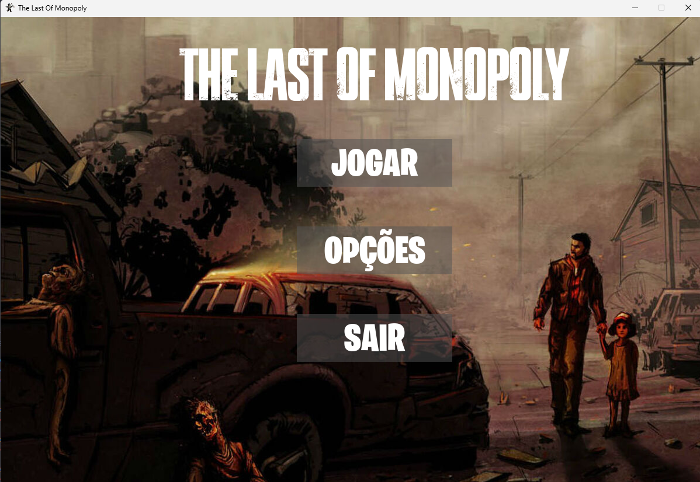
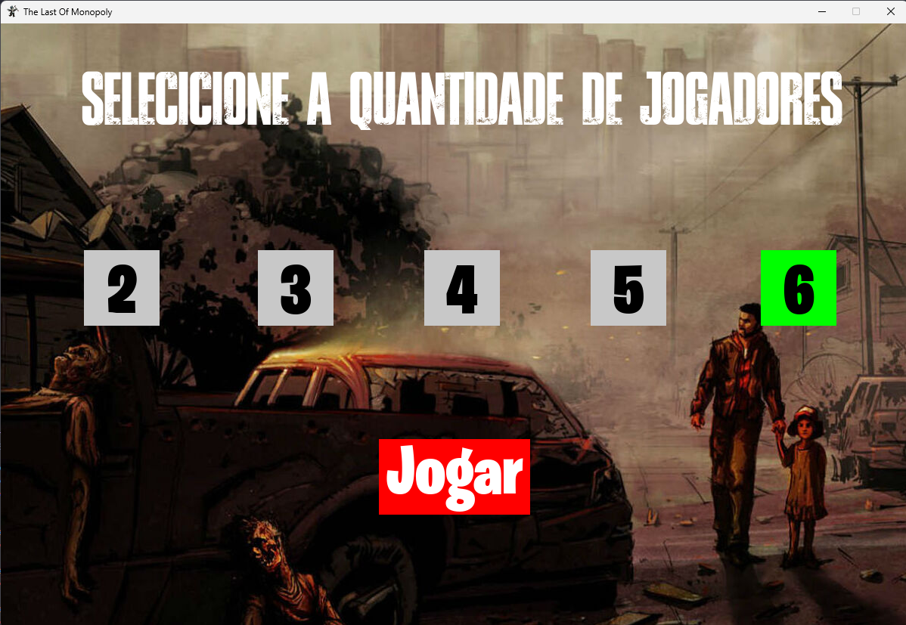
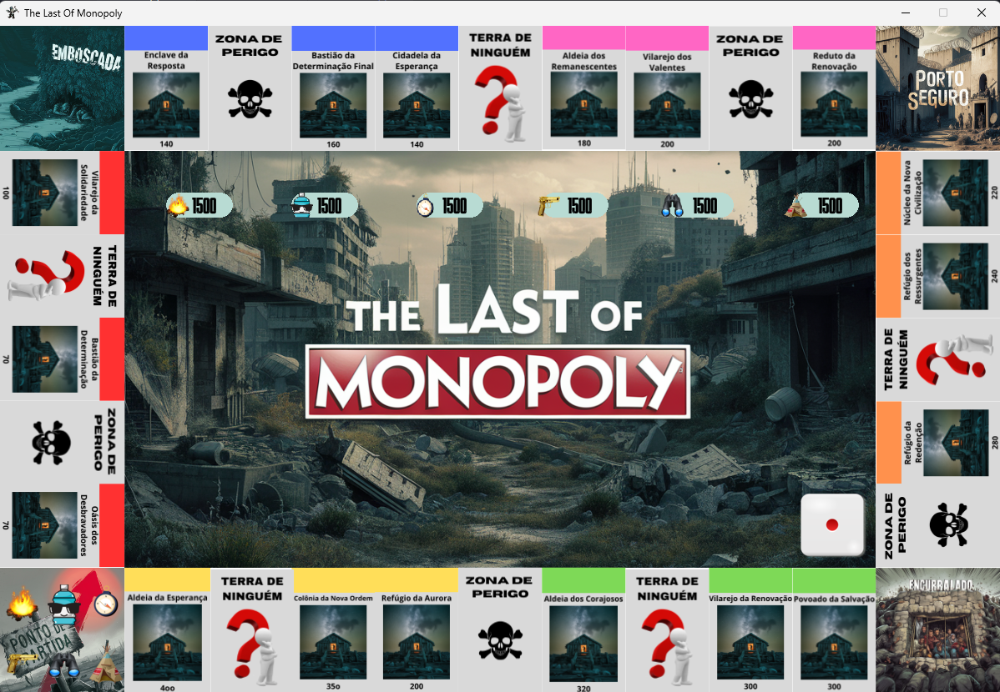

# The Last Of Monopoly

**ATÉ O MOMENTO (PROTÓTIPO INICIAL):**

**Menu principal com 3 botões (jogar, opções, sair)**
- Jogar -> vai pra tela de selecionar qtd de jogadores
- Opções -> sem nada no momento, talvez regras?
- Sair -> quit já funcionando

**Tela de Seleção da Quantidade de Jogadores com:**
- 5 botões pra quantidade de jogadores (2,3,4,5,6)
- 1 botão Jogar -> vai pra tela do jogo/tabuleiro
* Ao selecionar algum dos botões da qtd de jogadores ele troca de cor, indicando q foi selecionado
* Botão Jogar só funciona se uma qtd de jogadores for selecionada

**Tela do Jogo (Tabuleiro):**

Contém uma imagem inicial do tabuleiro
|- > Pensei em colocar essa imagem e a gente atribuir cada espaço das casas a alguma entidade, não sei se é a melhor forma de fazer isso, podemos pensar em algo diferente! 

Contém um dado, 6 faces, já funcional, de modo que qnd clicamos sobre ele, ele troca de face.
|-> Temos que implementar aquela lógica de checar se os resultados foram iguais pra dar outra chance de jogar ou se repetir 3 vezes mandar pro encurralado (prisão), além de usar o resultado obtido pro peão andar. Além disso, temos que configurar de modo a permitir rolar somente 2 vezes durante cada turno, se não tirar números iguais.

Peões já são desenhados na tela_jogo de acordo com a qtd de jogadores definida na tela_qtd_jogadores
|-> Temos que implementar toda a lógica de movimentação e outras funcionalidades..

Suprimentos dos jogadores são desenhados na tela do jogo também, de modo a acompanhar o quanto ele vai gastando, inicialmente com 1500

Cartas já são desenhadas na tela do jogo, até o momento a lógica da carta é a seguinte: inicia com a capa da carta.

**O que fazer a seguir:**
- Pensar se essa forma de construir o tabuleiro da certo! Se for utilzar a ideia que ta implementada no Tabuleiro tem q trocar os valores de aluguel e a lógica de cada espaço (o que acontece quando cai na casa terra de ninguém, no porto seguro...)
- Implementar uma classe Rodada, de modo a controlar o turno de cada jogador
- Implementar a lógica de movimentação do peão, de acordo com o resultado obtido no lançamento do dado durante o turno.
- Resto das funcionalides (IA, mandar pro encurralado, checar vitória, derrota, cartas, efeitos..)

